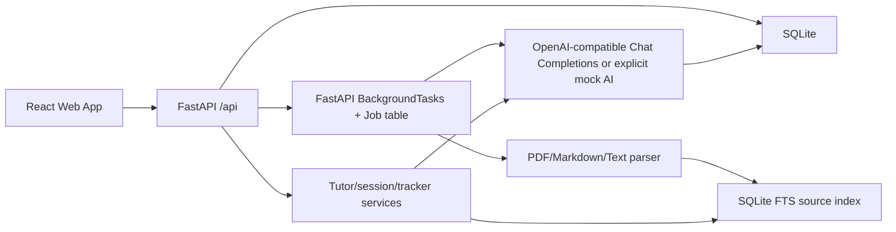

# Architecture

## Overview

The app is a monorepo with a FastAPI backend and Vite React frontend.

## Backend

- `app.main` creates the FastAPI app, CORS, startup database initialization, and routers.
- `app.models` contains SQLModel tables.
- `app.services.materials` extracts and chunks uploaded material.
- `app.services.retrieval` owns the SQLite FTS source chunk index and retrieval.
- `app.services.ai` wraps OpenAI-compatible Chat Completions and deterministic explicit mock output.
- `app.services.jobs` processes skill and material generation jobs.
- `app.services.learning` owns tutor profiles, trackers, knowledge maps, lesson steps, tutor sessions, messages, citations, learning gaps, and mastery updates.
- Auth uses email/password, Argon2 password hashing, and httpOnly Cookie sessions.

## Frontend

- React Router owns page navigation.
- TanStack Query owns server state and polling.
- Vite proxies `/api` requests to `http://127.0.0.1:8000`.
- Pages are task-oriented: Dashboard, Create Project, Job Status, Project Detail, Lesson, Review, Mistake Book.
- Project detail shows tracker, source diagnostics, knowledge map, session history, and lesson path.
- Lesson pages are tutor workspaces with structured steps, tutor chat, citations, and checks.

## Data Flow

- Skill project: `POST /api/projects` creates a learning space, tutor profile, tracker, and background job; job generates knowledge points, lessons, quiz items, and lesson steps.
- Material project: create project, upload file, parse text, chunk text, index chunks in SQLite FTS, generate knowledge map, lessons, quiz items, and source citations.
- Tutor session: create session, send messages, retrieve relevant source chunks, call the tutor LLM, store message citations, and end the session with a summary/tracker update.
- Quiz answer: backend grades the answer, records it, and creates mistake/review records when incorrect.
- Mastery update: quiz answers and session summaries update knowledge point mastery, learning gaps, and project tracker state.

## Planned V2 Learning Flow

The next implementation target is documented in
`docs/v2-learning-flow-optimization-plan.md`. It replaces the current
all-at-once generation job with persisted stages, job timeline UX,
retry/resume, explicit lesson-to-knowledge-point mapping, and dynamic tutor
assessment that updates mastery without requiring manual lesson completion.

## AI Strategy

- Prefer `LLM_API_KEY`, `LLM_BASE_URL`, `LLM_MODEL_FAST`, and `LLM_MODEL_SMART` for third-party compatible providers.
- `LLM_API_MODE=chat_completions` is the supported mode.
- `OPENAI_API_KEY`, `OPENAI_MODEL_FAST`, and `OPENAI_MODEL_SMART` remain legacy fallback settings.
- `APGL_MOCK_AI=true` enables deterministic local fallback content. If mock is false and LLM config/calls fail, jobs fail with visible errors.

## V2 APIs

- `GET /api/projects/{id}/tracker`
- `GET /api/projects/{id}/knowledge-map`
- `GET /api/projects/{id}/materials/status`
- `GET /api/lessons/{id}/steps`
- `POST /api/projects/{id}/sessions`
- `GET /api/projects/{id}/sessions`
- `GET /api/sessions/{id}/messages`
- `POST /api/sessions/{id}/messages`
- `POST /api/sessions/{id}/end`
