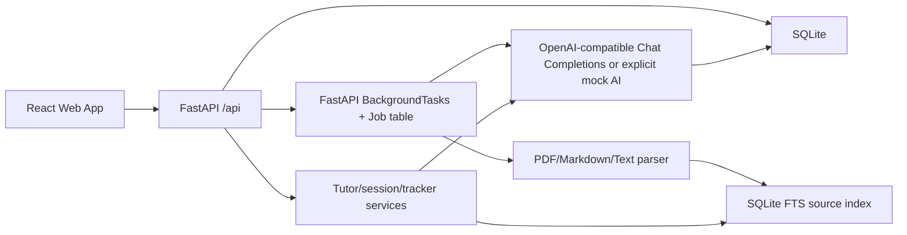

# Architecture

## Overview

The app is a monorepo with a FastAPI backend and Vite React frontend.

## Backend

- `app.main` creates the FastAPI app, CORS, startup database initialization, and routers.
- `app.models` contains SQLModel tables.
- `app.services.materials` extracts and chunks uploaded material.
- `app.services.retrieval` owns the SQLite FTS source chunk index and retrieval.
- `app.services.ai` wraps OpenAI-compatible Chat Completions and deterministic explicit mock output.
- `app.services.jobs` processes staged skill/material generation jobs, persists
  job stages and generation artifacts, and owns retry/resume orchestration.
- `app.services.learning` owns tutor profiles, trackers, knowledge maps, explicit
  lesson-to-knowledge-point mapping, lesson steps, tutor sessions, messages,
  citations, dynamic assessments, learning gaps, and mastery updates.
- Auth uses email/password, Argon2 password hashing, and httpOnly Cookie sessions.

## Frontend

- React Router owns page navigation.
- TanStack Query owns server state and polling.
- Vite proxies `/api` requests to `APGL_API_PROXY_TARGET`, defaulting to
  `http://127.0.0.1:8000`.
- Pages are task-oriented: Dashboard, Create Project, Job Status, Project Detail, Lesson, Review, Mistake Book.
- Project detail shows tracker, source diagnostics, knowledge map, session history, and lesson path.
- Lesson pages are tutor workspaces with structured steps, tutor chat, citations,
  dynamic assessment, mastery state, and weak-point feedback.

## Data Flow

- Skill project: `POST /api/projects` creates a learning space, tutor profile,
  tracker, persisted job stages, and a background job. The job separately
  creates a project brief, knowledge map, lesson plan, explicit lesson mappings,
  and first lesson content.
- Material project: `POST /api/projects/material` persists the uploaded file
  under `backend/data/uploads/`, creates a `SourceMaterial`, and starts the same
  staged generation pipeline. Material intake later parses text, chunks it, and
  indexes chunks in SQLite FTS.
- Tutor session: create session, send messages, retrieve relevant source chunks, call the tutor LLM, store message citations, and end the session with a summary/tracker update.
- Dynamic assessment: start or resume an active lesson assessment, ask one
  tutor-generated question, evaluate the answer through `services.ai`, clamp
  mastery changes, update weak points, and create compatibility `QuizItem`,
  `MistakeRecord`, and `ReviewTask` rows when review is needed.
- Mastery update: assessment answers, legacy quiz answers, and session summaries
  update knowledge point mastery, project tracker state, and project
  `progress_percent`. Projects are marked `passed` when mastery reaches the pass
  criteria and no high-severity gaps remain open.

## V2 Learning Flow

The V2 flow replaces all-at-once generation with persisted stages:

1. Understand learning goal
2. Parse learning material
3. Build source index
4. Create project brief
5. Build knowledge map
6. Plan tutor learning path
7. Prepare first lesson
8. Ready

`JobStage` records drive the frontend timeline. `GenerationArtifact` records
persist stage outputs and input hashes so retry/resume can reuse completed work.
`LessonKnowledgePoint` maps every knowledge point to at least one lesson.
`AssessmentSession` and `AssessmentTurn` store resumable dynamic quiz sessions.

## AI Strategy

- Prefer `LLM_API_KEY`, `LLM_BASE_URL`, `LLM_MODEL_FAST`, and `LLM_MODEL_SMART` for third-party compatible providers.
- `LLM_API_MODE=chat_completions` is the supported mode.
- `OPENAI_API_KEY`, `OPENAI_MODEL_FAST`, and `OPENAI_MODEL_SMART` remain legacy fallback settings.
- `APGL_MOCK_AI=true` enables deterministic local fallback content. If mock is false and LLM config/calls fail, jobs fail with visible errors.

## V2 APIs

- `GET /api/projects/{id}/tracker`
- `GET /api/projects/{id}/knowledge-map`
- `GET /api/projects/{id}/materials/status`
- `GET /api/lessons/{id}/steps`
- `POST /api/projects/{id}/sessions`
- `GET /api/projects/{id}/sessions`
- `GET /api/sessions/{id}/messages`
- `POST /api/sessions/{id}/messages`
- `POST /api/sessions/{id}/end`
- `GET /api/jobs/{id}` with ordered stage timeline
- `POST /api/jobs/{id}/retry`
- `POST /api/jobs/{id}/resume`
- `POST /api/lessons/{id}/prepare`
- `POST /api/lessons/{id}/assessment/start`
- `GET /api/assessments/{id}`
- `POST /api/assessments/{id}/answer`
- `POST /api/assessments/{id}/end`
