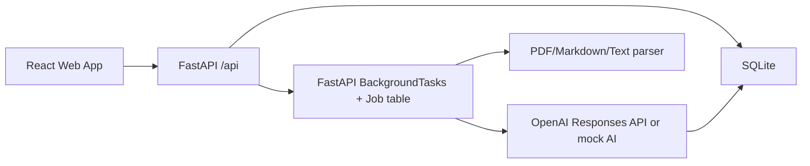

# Architecture

## Overview

The app is a monorepo with a FastAPI backend and Vite React frontend.

## Backend

- `app.main` creates the FastAPI app, CORS, startup database initialization, and routers.
- `app.models` contains SQLModel tables.
- `app.services.materials` extracts and chunks uploaded material.
- `app.services.ai` wraps OpenAI Responses API and deterministic fallback output.
- `app.services.jobs` processes skill and material generation jobs.
- Auth uses email/password, Argon2 password hashing, and httpOnly Cookie sessions.

## Frontend

- React Router owns page navigation.
- TanStack Query owns server state and polling.
- Vite proxies `/api` requests to `http://127.0.0.1:8000`.
- Pages are task-oriented: Dashboard, Create Project, Job Status, Project Detail, Lesson, Review, Mistake Book.

## Data Flow

- Skill project: `POST /api/projects` creates a project and background job; job generates lessons and quiz items.
- Material project: create project, upload file, parse text, chunk text, generate lessons and quiz items.
- Quiz answer: backend grades the answer, records it, and creates mistake/review records when incorrect.

## AI Strategy

- `OPENAI_MODEL_FAST`: default `gpt-5-mini` for extraction-like tasks.
- `OPENAI_MODEL_SMART`: default `gpt-5.2` for tutoring and grading.
- If `OPENAI_API_KEY` is missing or `APGL_MOCK_AI=true`, backend uses deterministic fallback content.

